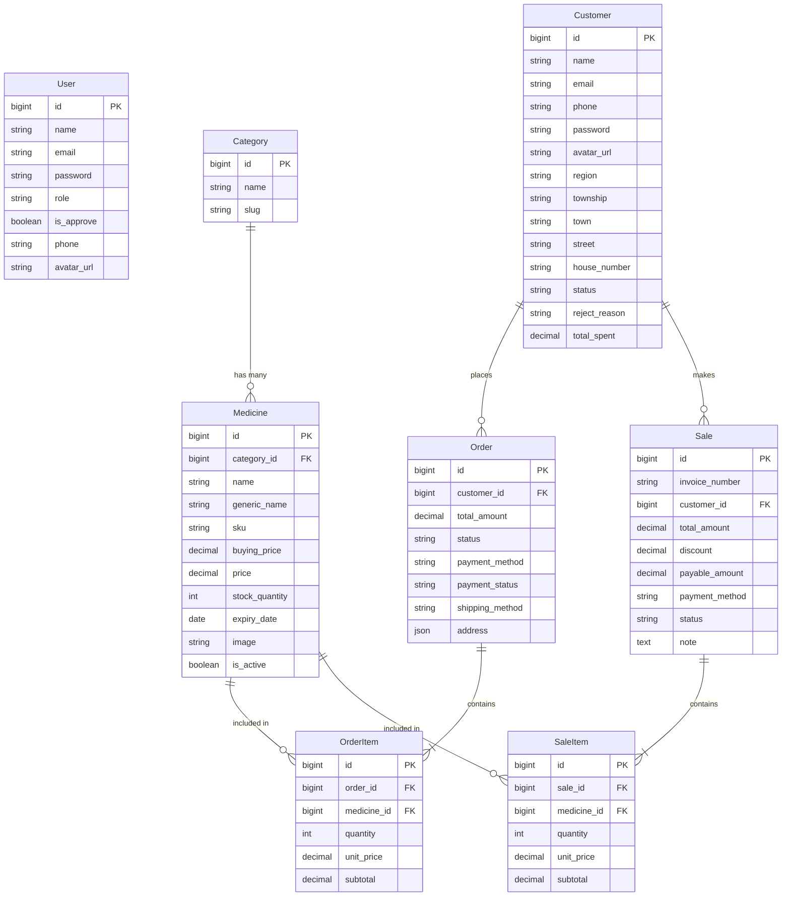

# Entity Relationship Diagram

Here is the Entity Relationship Diagram (ERD) for the Zwetoe Pharmacy application.

```mermaid
erDiagram
    User {
        bigint id PK
        string name
        string email
        string password
        string role
        boolean is_approve
        string phone
        string avatar_url
    }
    
    Category {
        bigint id PK
        string name
        string slug
    }
    
    Customer {
        bigint id PK
        string name
        string email
        string phone
        string password
        string avatar_url
        string region
        string township
        string town
        string street
        string house_number
        string status
        string reject_reason
        decimal total_spent
    }
    
    Medicine {
        bigint id PK
        bigint category_id FK
        string name
        string generic_name
        string sku
        decimal buying_price
        decimal price
        int stock_quantity
        date expiry_date
        string image
        boolean is_active
    }
    
    Order {
        bigint id PK
        bigint customer_id FK
        decimal total_amount
        string status
        string payment_method
        string payment_status
        string shipping_method
        json address
    }
    
    OrderItem {
        bigint id PK
        bigint order_id FK
        bigint medicine_id FK
        int quantity
        decimal unit_price
        decimal subtotal
    }
    
    Sale {
        bigint id PK
        string invoice_number
        bigint customer_id FK
        decimal total_amount
        decimal discount
        decimal payable_amount
        string payment_method
        string status
        text note
    }
    
    SaleItem {
        bigint id PK
        bigint sale_id FK
        bigint medicine_id FK
        int quantity
        decimal unit_price
        decimal subtotal
    }

    Category ||--o{ Medicine : "has many"
    Customer ||--o{ Order : "places"
    Order ||--|{ OrderItem : "contains"
    Medicine ||--o{ OrderItem : "included in"
    Customer ||--o{ Sale : "makes"
    Sale ||--|{ SaleItem : "contains"
    Medicine ||--o{ SaleItem : "included in"
```
